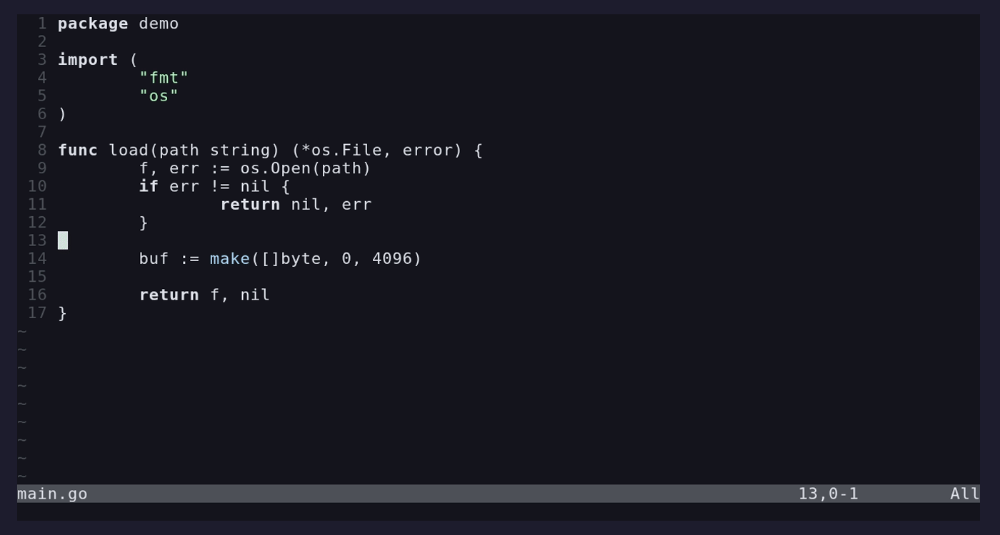

# q4tab

Fully local code completion trained on your codebase. Statistical
n-gram model plus verbatim line retrieval: no cloud, no GPU, no
network calls, no LLM. Single-digit-millisecond suggestions, single
and multi-line.

It learns as you type through per-file and session caches, and trained
on your own repos it suggests your real internal APIs rather than
generic ones.



## Install

Tagged releases publish archives for linux, darwin, and windows on
amd64 and arm64, plus the packaged VS Code extension and the Neovim
plugin tarball. Tags `v*` are protected by a repository ruleset: once
pushed they cannot be deleted, rewritten, or moved.

```sh
# verify a release asset
curl -LO https://github.com/Quad4-Software/q4tab/releases/download/v0.1.0/q4tab_0.1.0_linux_amd64.tar.gz
curl -LO https://github.com/Quad4-Software/q4tab/releases/download/v0.1.0/checksums.txt
sha256sum -c checksums.txt --ignore-missing

# keyless sigstore signature, tied to the release run
curl -LO https://github.com/Quad4-Software/q4tab/releases/download/v0.1.0/q4tab_0.1.0_linux_amd64.tar.gz.sigstore.json
cosign verify-blob --bundle q4tab_0.1.0_linux_amd64.tar.gz.sigstore.json q4tab_0.1.0_linux_amd64.tar.gz

# SLSA build provenance lives in the repo attestations
gh attestation verify q4tab_0.1.0_linux_amd64.tar.gz --repo Quad4-Software/q4tab
```

Build from source:

```sh
go build -o bin/q4tab ./cmd/q4tab
cp bin/q4tab ~/.local/bin/
```

## Train

```sh
q4tab collect --org Quad4-Software --dest ~/corpus   # optional mirror
q4tab index --root ~/projects --root ~/corpus
```

The model lands in `~/.local/share/q4tab/model.bin` plus a manifest for
incremental updates. For scale reference: 272M tokens of mixed source
indexes in about 7 minutes on a desktop CPU into a ~2.8GB packed model.
The file is mmap'd read-only, loads in under a second, and only ~340MB
stays resident.

The default build is a disk-spill pipeline: workers emit sorted run
files to `-tmpdir` (a few GB of scratch), then a k-way merge assembles
the packed tables. Peak RSS stays around 6-7GB regardless of corpus
size. `-workers` sets the pool size, `-spill=false` selects the
in-memory path, `-budget`/`-mem` bound memory further. Duplicate,
generated, vendored, and minified files are skipped.

### Incremental index

```sh
q4tab index -incr --root ~/projects --root ~/corpus
```

Diffs the tree against the manifest and folds new or changed files into
`model.bin.delta`, an overlay the server merges at startup. A full
`index` rebuild folds everything back into the base.

## QA

```sh
q4tab eval -root ~/projects/somerepo -files 50 -pos 10
```

`eval` samples mid-line cursor positions in real files, masks the tail,
and reports hit@1 / hit@k and p50/p95 latency per language. `-v` prints
misses. `go test -fuzz=FuzzLex ./internal/tokenize/` fuzzes the lexer.

## Commit messages

`commitmsg` drafts conventional-commit messages from the staged diff,
trained on the repo's own git history:

```sh
q4tab commitmsg -train -repo . -o ~/.local/share/q4tab/commits/myrepo
q4tab index -root ~/.local/share/q4tab/commits/myrepo -o /tmp/commit-model.q4m
git add -p && q4tab commitmsg -model /tmp/commit-model.q4m
```

Config is `~/.config/q4tab/config.json`:

```json
{
  "roots": ["~/projects", "~/corpus"],
  "order": 6,
  "maxLines": 4
}
```

## VS Code

```sh
cd vscode
npm install
npm run package
code --install-extension q4tab-0.1.0.vsix
```

The extension spawns `q4tab serve` (resolved in order: the configured
`q4tab.serverPath`, the binary bundled in the vsix, then PATH) and
provides ghost-text inline suggestions and the classic dropdown. Tab
accepts, Esc dismisses, Ctrl+Right accepts one word.

Commands on the palette include `q4tab: Index Workspace` (folds open
folders into the incremental delta and hot-reloads), `Restart Server`,
`Toggle Completions`, `Show Status`, and `Show Log`.

Settings: `q4tab.serverPath`, `q4tab.modelPath`, `q4tab.enabled`,
`q4tab.maxSuggestions`, `q4tab.requestTimeout`.

## Neovim

Requires Neovim 0.12+, which has native `vim.lsp.inline_completion`.

Put `nvim/` on your runtimepath (plugin manager, or symlink `nvim/`
into `~/.config/nvim/pack/*/start/`). Then:

```lua
require("q4tab").setup()
```

`Tab` accepts, `Alt-]` / `Alt-[` cycle candidates, and accepts are
reported back to the server automatically.
`:lua require("q4tab").toggle()` flips suggestions on and off.
`setup({ completion = true })` also enables builtin popup completion.

Minimal config without the plugin, 0.12+:

```lua
vim.lsp.config('q4tab', { cmd = { 'q4tab', 'serve' } })
vim.lsp.enable('q4tab')
vim.lsp.inline_completion.enable()
```

## Server deployment

Completions are one small request per keystroke, so the transport is
plain request/response over a persistent TCP socket or HTTP.

```sh
# LSP over TCP (same framing as stdio)
q4tab serve -listen 127.0.0.1:7917

# HTTP
q4tab serve -http 127.0.0.1:7918
#   POST /rpc      JSON-RPC, same methods as the LSP transport
#   POST /mcp      MCP endpoint
#   GET  /status   engine stats as JSON
#   GET  /healthz  liveness
```

Both flags can be combined. Each TCP connection gets an isolated
document session; `/rpc` shares one session so didOpen/didChange state
persists.

Remote mode:

```json
{ "q4tab.serverAddr": "10.0.0.5:7917" }
```

```lua
require("q4tab").setup({ addr = "10.0.0.5:7917" })
```

Warning: the model contains verbatim source lines. Bind to loopback or
put the listener behind a VPN/TLS terminator before exposing it.

## MCP

q4tab doubles as an MCP server so coding agents can ground themselves
in the corpus instead of guessing APIs.

```sh
q4tab mcp   # stdio transport, one JSON-RPC message per line
```

Point any MCP client at that command or POST to `/mcp` on the HTTP
listener. Speaks MCP `2025-06-18`, `2025-03-26`, `2024-11-05`, and
`server/discover`.

| tool | args | returns |
|---|---|---|
| `complete` | `text`+`offset` or `path`+`line`/`character` | ranked completion items |
| `lookup_lines` | `prefix`, `limit` | verbatim corpus lines |
| `learn` | `text`, `uri`, `line` | feeds the accept-learning loop |
| `status` | none | corpus size, counters, memory |

## Other editors

The server speaks LSP 3.18 including `textDocument/inlineCompletion`.
Any client implementing that method works with `q4tab serve` over
stdio.

```sh
q4tab complete -f somefile.go -line 12 -col 20   # CLI check
q4tab stats
```

## How it works

Retrieval first, generation second: the engine searches your corpus
and open files for lines that match what you are typing (rebinding
identifiers to your names when shapes match), and falls back to a
Kneser-Ney n-gram decode when nothing attested fits. Accepts and
rejects feed back into ranking. See
[docs/architecture.md](docs/architecture.md),
[docs/model.md](docs/model.md),
[docs/retrieval.md](docs/retrieval.md),
[docs/ranking.md](docs/ranking.md), and
[docs/protocol.md](docs/protocol.md).

It finishes lines and blocks it has seen before; it cannot invent APIs
it has never seen. What it knows is exactly what your corpus and open
files contain.

## License

[0BSD](LICENSE)
